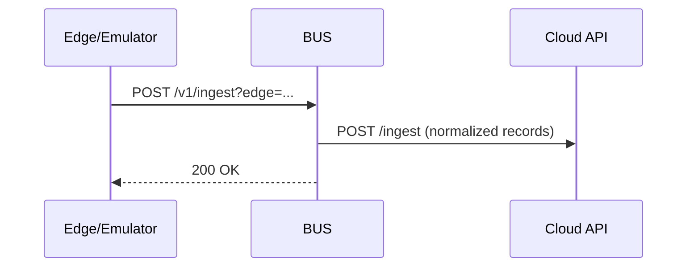

# Drill BUS Service

Промежуточный сервис сбора данных (ingest) и трансляции логов по SSE. Принимает телеметрию от edge/источников, нормализует формат и пересылает в `cloud`.

## Назначение
- прием телеметрии с устройств/эмуляторов
- преобразование данных к формату `cloud` ingest
- трансляция логов в режиме реального времени (SSE)

## Основные эндпоинты
- `POST /v1/ingest?edge=EDGE_ID` — принимает JSON с датой и набором `tag:value`
- `GET /log` — SSE поток логов (подписывается `log.monitor`)

## Поток данных


## Конфигурация
Сервис использует `ConfigModule`. В контроллере ingest целевой URL `cloud` задан явно
(`http://localhost:3000/ingest`). При необходимости вынесите его в переменную окружения
(`CLOUD_API_INGEST_URL`) и используйте её в коде.

## Запуск
```bash
npm install
npm run start:dev
```

## Сборка
```bash
npm run build
npm run start:prod
```

## Связь с другими сервисами
- **cloud**: прием нормализованных данных
- **log.monitor**: UI для просмотра SSE‑логов
